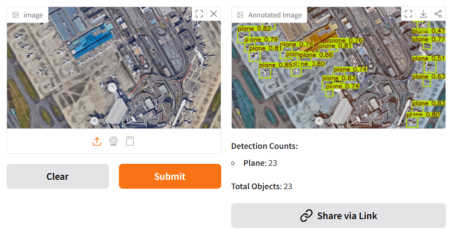

# Aerial Plane-Ship-Harbour-Vehicle Detector (YOLOv8)

**Team:** Kernel Ninjas  
**Team Lead:** Mabo Giqwa  
**Teammates:** Dr San Sahasra, Siphelele Ndlovu, Sello Serutle, Fortune Mkhwebane

## Overview
This project is an aerial imagery aircraft, harbour, ship, and vehicle detection system built for the **inaugural UNISA Hackathon**. The solution uses a **YOLOv8** object detection model trained on the **DOTA v1.0** dataset to detect planes, harbour, ship and vehicles in aerial images. The application is deployed using **Hugging Face Spaces** as the backend and presented via a simple web interface.

Hackathon reference: <https://www.unisa.ac.za/sites/myunisa/default/News/Articles/Unisa-hosts-first%E2%80%93ever-Hackathon-to-ignite-student-learning-experience>

## Website
Live demo: [https://mabogiqwa.github.io/aerial-ml/](https://mabogiqwa.github.io/aerial-ml/)

## Model & Training
- **Architecture:** YOLOv8
- **Dataset:** DOTA v1.0 (aerial object detection dataset)
- **Training platform:** Google Colab
- **Accelerator:** TPUs
- **Data split used:**
  - Train: **1,302 images**
  - Validation: **109 files**

The model was initially trained in Google Colab using TPUs for faster experimentation and iteration.

## System Architecture
- **Backend:** Hugging Face Spaces (serving the YOLOv8 model for inference)
- **Frontend:** Lightweight HTML page embedding the Space via an iframe
- **Inference flow:**
  1. User uploads an aerial image via the web UI.
  2. The request is forwarded to the Hugging Face Space backend.
  3. YOLOv8 performs object detection.
  4. The annotated result is returned to the user along with the amount of each object class is detected in the image.

## Example of Prediction


## Model performance


## Folder structure for training YOLO model
```text
dataset/
├── images/
│   ├── training/    # Training images
│   └── val/         # Validation images
└── labels/
    ├── training/    # Training labels (YOLO format)
    └── val/         # Validation labels (YOLO format)
```

## Training
To reproduce training:
- Prepare the **DOTA v1.0** dataset in YOLO format.
- Use **YOLOv8** training scripts/notebooks in Google Colab.
- Configure Colab to use **TPUs**.
- Set the train/val splits similar to:
  - Train: 1,302 images
  - Val: 109 files

## MIT License

Copyright (c) 2025 mabogiqwa

Permission is hereby granted, free of charge, to any person obtaining a copy
of this software and associated documentation files (the "Software"), to deal
in the Software without restriction, including without limitation the rights
to use, copy, modify, merge, publish, distribute, sublicense, and/or sell
copies of the Software, and to permit persons to whom the Software is
furnished to do so, subject to the following conditions:

The above copyright notice and this permission notice shall be included in all
copies or substantial portions of the Software.

THE SOFTWARE IS PROVIDED "AS IS", WITHOUT WARRANTY OF ANY KIND, EXPRESS OR
IMPLIED, INCLUDING BUT NOT LIMITED TO THE WARRANTIES OF MERCHANTABILITY,
FITNESS FOR A PARTICULAR PURPOSE AND NONINFRINGEMENT. IN NO EVENT SHALL THE
AUTHORS OR COPYRIGHT HOLDERS BE LIABLE FOR ANY CLAIM, DAMAGES OR OTHER
LIABILITY, WHETHER IN AN ACTION OF CONTRACT, TORT OR OTHERWISE, ARISING FROM,
OUT OF OR IN CONNECTION WITH THE SOFTWARE OR THE USE OR OTHER DEALINGS IN THE
SOFTWARE.

